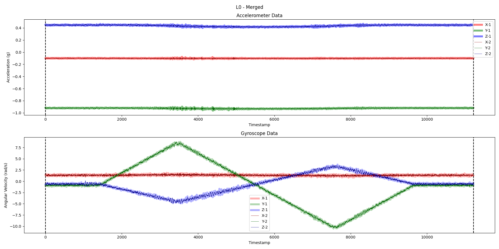
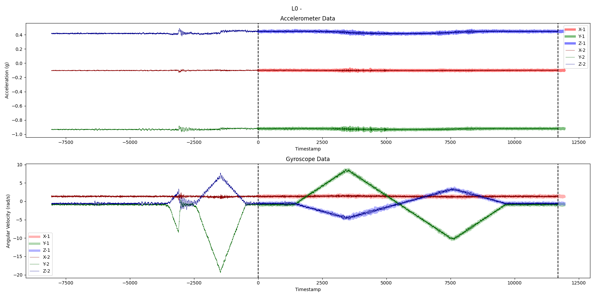
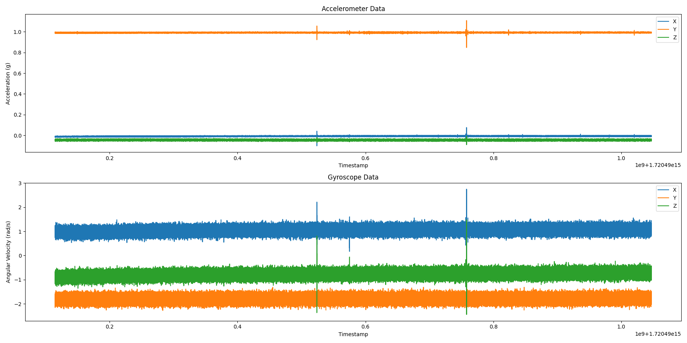

# Event Camera and IMU-based Spatiotemporal Registration


This project implements spatiotemporal registration of multiple event camera recordings using IMU data as reference, specifically designed for aligning repeated motion trajectories captured from different perspectives.

## Key Features

- **Multi-sensor Data Processing**
  - AEDAT4 event stream extraction
  - IMU data synchronization and alignment
  - Automatic temporal offset estimation

- **Advanced Filtering**
  - Kalman filter for IMU noise reduction
  - Savitzky-Golay smoothing
  - Adaptive downsampling

- **Registration & Visualization**
  - Cross-correlation based time alignment
  - Trajectory matching visualization
  - Multi-camera fusion output

### Example Output


### Example Input


## Installation

### Requirements
- Python 3.7+ (Anaconda recommended)
- Linux/Windows/MacOS (tested on Ubuntu 20.04)

```bash
conda create -n event_reg python=3.8
conda activate event_reg
pip install -r requirements.txt
```

## Data Organization

Organize your dataset in the following structure:
```
VIDEOS-3/
└── Group-1/               # Recording session group
    ├── camera01/          # First device
    │   ├── frame_event/   # Event-based frames
    │   ├── events.aedat4  # Raw event data
    │   ├── video.mp4      # Frame-based video
    │   └── imu.npy        # IMU measurements
    └── camera02/          # Second device
```

## Usage Pipeline

### 1. Data Extraction (for each group)
```bash
python registration/extract_aedat4.py \
    --aedat_folder="VIDEOS/Group-1/" \
    --video_folder="VIDEOS/Group-1/"
```

### 2. IMU Visualization
```bash
python registration/plt_imu_2d_3d.py --video_root="VIDEOS/"
```

### 3. Temporal Registration (Core Algorithm)
```bash
python registration/main.py \
    --video_group_root="VIDEOS-3/" \
    --output_dir="results/"
```

### 4. Result Visualization
```bash
python registration/make_registration_visualization_of_each_group.py \
    --group_root="results/Group-1/"
```

## Algorithm Overview

### Temporal Alignment Workflow
1. **IMU Preprocessing**
   - Apply Kalman filtering for noise reduction
   - Downsample to common timebase
   - Extract acceleration/gyroscope features

2. **Cross-correlation Matching**
   ```python
   def registrate_two_imus(S, T):
       # Kalman filtering implementation
       acc_bais, gyr_bais, acc_ll, gyr_ll = registrate(S, T, "kalman")
       return alignment_params
   ```

3. **Multi-trajectory Fusion**
   - Find optimal overlapping window
   - Generate unified timeline reference

## Output Structure

```
results/
├── Group-1/
│   ├── registrate_result.json  # Alignment parameters
│   ├── V-1-to-0-merged.png     # IMU comparison plot
```

Example of `registrate_result.json`: the alignment parameters for each pair of recordings.
```json
{
    "s001-125000-2025_02_27_16_03_41": {
        "start_index_of_imu": 2408,
        "end_index_of_imu": 18210,
        "start_timestamp": 1740643424149311.0,
        "end_timestamp": 1740643439949963.0,
        "time_duration": 15800652.0
    },
    "s001-250000-2025_02_27_16_03_02": {
        "start_index_of_imu": 0,
        "end_index_of_imu": 15802,
        "start_timestamp": 1740643382750853.0,
        "end_timestamp": 1740643398550491.0,
        "time_duration": 15799638.0
    }
}
```


## Configuration Parameters

| Parameter | Default | Description |
|-----------|---------|-------------|
| `Q` | 0.01 | Process noise covariance |
| `R` | 0.1 | Measurement noise covariance |
| `--imu_window` | 50 | Moving average window size |
| `--rotation_threshold` | 0.3 | Gyroscope activation threshold |


## Troubleshooting

**Q: No module named 'registration'**
A: Set Python path correctly:
```bash
export PYTHONPATH="$PWD:$PYTHONPATH"
```

**Q: Poor IMU alignment results**
A: Try adjusting Kalman filter parameters in `calibration.py`:
```python
Q = np.diag([0.01, 0.01, 0.01])  # Process noise
R = np.diag([0.1, 0.1, 0.1])     # Measurement noise
```




## License
Apache 2.0 License. See [LICENSE](LICENSE) for details.

